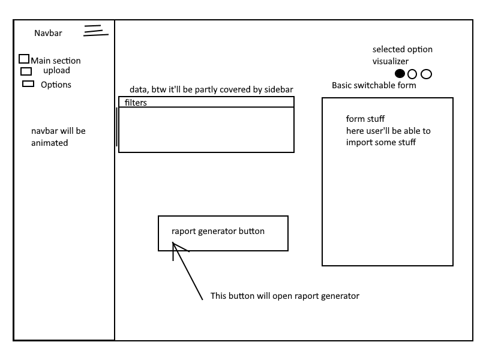
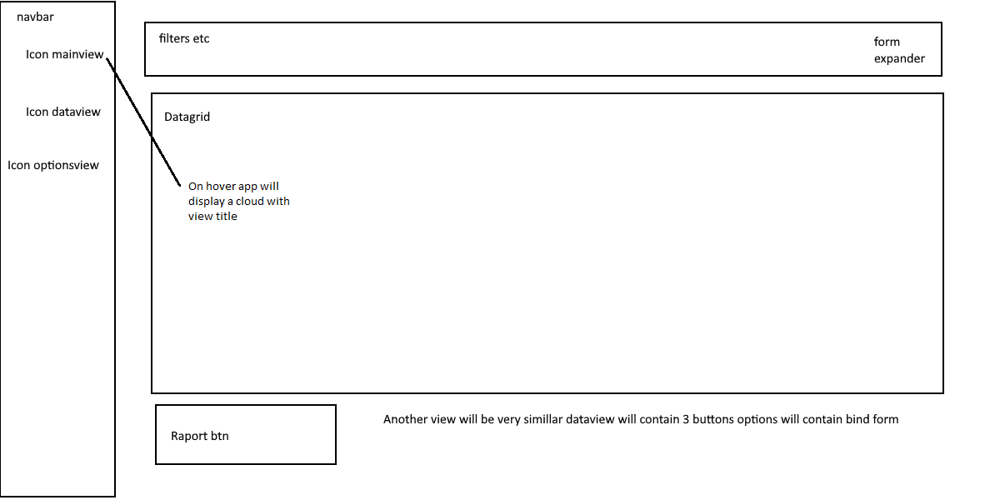
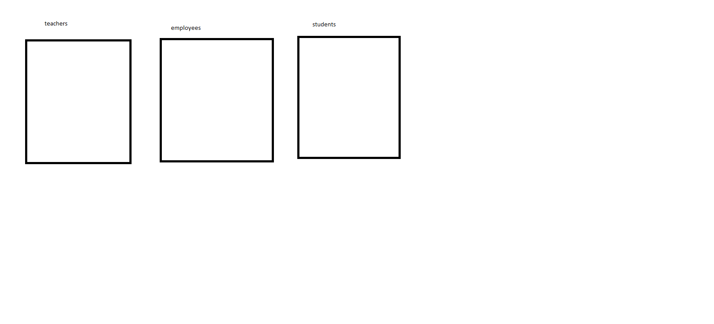

# secretariat
## So this is secretariat app, it even works

 
## App concepts
<h3>first app concept</h3>

<h3>second app concept</h3>
<h6>This is implemented version</h6>

<h3>Very simple 'pre-database' concept</h3>

[click me to see testing appConcept.txt](https://github.com/mmorawski520/secretariat/blob/master/appConcepts/AppConcept.txt)

## Testing harmonogram

[click me to see testing harmonogram](https://github.com/mmorawski520/secretariat/blob/master/testingHarmonogram.txt)

## Bug fixes

- Jan 2, 2022 implementation of app guide
- Jan 2, 2022 Update exportedData.txt
- Dec 31, 2021 just uploaded exported data
- Dec 31, 2021 deletion of useless files
- Dec 31, 2021 adding bin folder, because I want to be sure that everything will be working properly
- Dec 31, 2021 Validation, layout improvements, changes in file structure
- Dec 31, 2021 edit form rework and keybinding rework
- Dec 29, 2021 Image uploading had been implemented
- Dec 29, 2021  Optymalization, I had created Raport class and Serializer class
- Dec 29, 2021  form rework
- Dec 28, 2021  Implementation of form cleaner
- Dec 28, 2021 I had improved file saving I had replaced JSON serializer with my own serializer
- Dec 28, 2021 removing of image_path column had been implented, I also had tested this
- Dec 20, 2021 some syntax changes
- Dec 20, 2021 I had implemented row deleting and filtering  by age. I'll optymilize this in the future :v
- Dec 18, 2021 I've just removed useless libraries
- Dec 14, 2021 syntax improvement
- Dec 14, 2021  just deleted useless files and moved useful classes into classes folder to improve clearness of project
- Dec 12, 2021  I've just finished shortcut binding I've finished options view (now user can change the binding)
- Dec 12, 2021 just made user able to delete rows
- Dec 12, 2021 just finished and tested pop up which allows user to edit selcted row
- Dec 5, 2021 I had made db uploader and I had fixed db dumper I had also testes both of them :v
- Dec 5, 2021 just finished file generator
- Dec 4, 2021 just finished and tested file uploading
- Dec 3, 2021 syntax improvement
- Dec 3, 2021 uploading file btn
- Dec 3, 2021 dbHelper bugfix
- Dec 2, 2021 just finished basic db dumper
- Dec 2, 2021 just made simple lesson uploader
- Dec 2, 2021 just added lesson class
- Dec 2, 2021 I've just finished searcher + I've already fixed form switcher There are some new methods in DbHelper class (idSelect,likeSelect)
- Dec 1, 2021 Db and dbHelper rework, I changed db structure + I made small improvement in employee class
- Dec 1, 2021 mainView rework, layout was look awful and it was also useless so I decided to spent over 2 hours on it ;-;
- Nov 30, 2021 just made a prototype of DbHelper class and DB
- Nov 30, 2021  I've just made functions responsible for adding new elements into the list, I've improved navbar pop ups + I've installed sqlite
- Nov 28, 2021 just made simple mvvc - prototype of mainview + basic fomrs - prototype of  dataview - prototype of optionsview
- Nov 28, 2021 navbar rework +  for the assets
- Nov 26, 2021 Add files via upload
- Nov 26, 2021 just finished sidebar prototype, I'll improve it in the future
- Nov 24, 2021 small improvement (just rebuilt classes Employee,Student,Teacher)
- Nov 24, 2021 Another Concept Improvement
- Nov 24, 2021 I've just prepared files for classes (Employee,Student,Teacher).
- Nov 24, 2021 some improvements in AppConcept
- Nov 24, 2021 I've just made implemented abstract class Person
